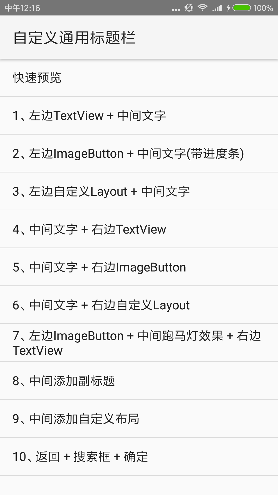
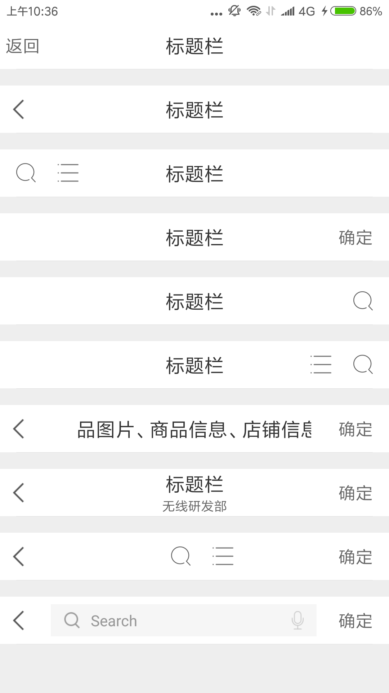

# CommonTitleBar

开发过程中，如果页面过多，需要构建大量重复的标题栏布局，浪费开发时间且不利于后期维护。本项目总结了几种常用的使用场景，将标题栏封装成控件，Java代码实现，对当前主流的沉浸式提供了支持，供有需要的同学使用，欢迎提供改进意见。

[APK下载](https://www.pgyer.com/2Ptg)

功能描述
=======
1. 支持左、中、右常规标题栏设置；  
2. 支持自定义视图；  
3. 支持沉浸式标题栏；  
  
  





使用介绍
=======

```xml
<com.wuhenzhizao.widget.CommonTitleBar
    xmlns:titlebar="http://schemas.android.com/apk/res-auto"
    android:id="@+id/titlebar"                     
    android:layout_width="match_parent"
    android:layout_height="wrap_content"
    titlebar:titleBarColor="color"             // 标题栏背景颜色
    titlebar:fillStatusBar="boolean"           // 填充状态栏，true时，标题栏会创建一块和系统状态栏同高的视图，用于沉浸式标题栏
    titlebar:statusBarColor="color"            // 使用沉浸式标题栏时，标题栏显示的颜色
    titlebar:titleBarHeight="dimension"        // 标题栏高度
    titlebar:showBottomLine="boolean"          // 是否显示标题栏底部的分割线   
    titlebar:bottomLineColor="color"           // 标题栏分割线颜色
    titlebar:bottomElevation="dimension"       // 是否显示elevation效果 默认根据系统版本加入
    titlebar:leftType="none|textView|imageBotton|customView"    // 左侧视图类型：无|文字|按钮|自定义视图
    titlebar:leftText="string"                 // 左侧文字leftType= textView有效
    titlebar:leftTextColor="color"             // 左侧文字颜色
    titlebar:leftTextSize="dimension"          // 左侧文字大小
    titlebar:leftDrawable ="reference"         // leftType= textView时，对应的drawableLeft图片
    titlebar:leftDrawablePadding="dimension"   // leftType= textView时，对应的drawablePadding
    titlebar:leftImageResource="reference"     // leftType= imageBotton时，左侧按钮对应的图片资源引用
    titlebar:leftCustomView ="reference"       // leftType= customView时，左侧布局资源引用
    titlebar:rightType="none|textView|imageBotton|customView"   // 右侧视图类型：无|文字|按钮|自定义视图
    titlebar:rightText="string"                // 右侧文字rightType= textView有效
    titlebar:rightTextColor="color"            // 右侧文字颜色
    titlebar:rightTextSize="dimension"         // 右侧文字大小
    titlebar:rightImageResource="reference"    // rightType= imageBotton时，右侧按钮对应的图片资源引用
    titlebar:rightCustomView="reference"       // rightType= customView时，右侧布局资源引用
    titlebar:centerType="none|textView|searchView|customView"   // 中间视图类型：无|文字|搜索框|自定义视图
    titlebar:centerSearchRightType="voice|delete"               // 搜索框右侧按钮类型：语音按钮|删除按钮
    titlebar:centerText="string"               // 标题文字centerType = textView有效
    titlebar:centerTextColor="color"           // 标题文字颜色
    titlebar:centerTextSize="dimension"        // 标题文字大小
    titlebar:centerSubText="string"            // 副标题文字
    titlebar:centerSubTextColor="color"        // 副标题文字颜色
    titlebar:centerSubTextSize="dimension"     // 副标题文字大小
    titlebar:centerSearchEdiable="boolean"     // 搜索框是否可以输入，对应centerType =searchView
    titlebar:centerSearchBg="reference"        // 搜索框背景
    titlebar:centerCustomView="reference"/>    // 中间自定义视图
```  

监听标题栏操作
=========== 

```java
((CommonTitleBar) findViewById(R.id.titlebar)).setListener(new CommonTitleBar.OnTitleBarListener() {
    @Override
    public void onClicked(View v, int action, String extra) {
        if (action == CommonTitleBar.ACTION_LEFT_TEXT) {
            ...
        }
        // CommonTitleBar.ACTION_LEFT_TEXT;        // 左边TextView被点击
        // CommonTitleBar.ACTION_LEFT_BUTTON;      // 左边ImageBtn被点击
        // CommonTitleBar.ACTION_RIGHT_TEXT;       // 右边TextView被点击
        // CommonTitleBar.ACTION_RIGHT_BUTTON;     // 右边ImageBtn被点击
        // CommonTitleBar.ACTION_SEARCH;           // 搜索框被点击,搜索框不可输入的状态下会被触发
        // CommonTitleBar.ACTION_SEARCH_SUBMIT;    // 搜索框输入状态下,键盘提交触发
        // CommonTitleBar.ACTION_SEARCH_VOICE;     // 语音按钮被点击
        // CommonTitleBar.ACTION_SEARCH_DELETE;    // 搜索删除按钮被点击
        // CommonTitleBar.ACTION_CENTER_TEXT;      // 中间文字点击
    }
});
```  


注意点
=====   
1. 使用自定义视图时(leftType|rightType|centerType="customView"），需要指定视图id，否则会抛出检查异常


