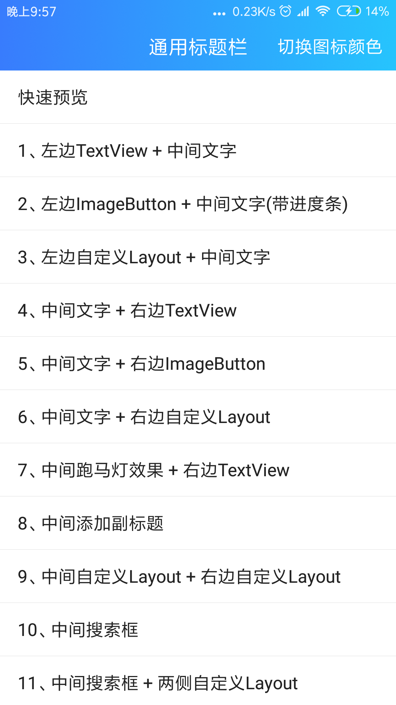
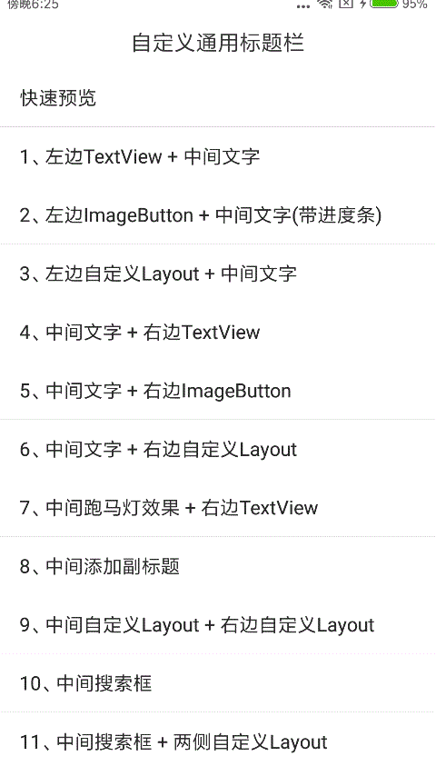
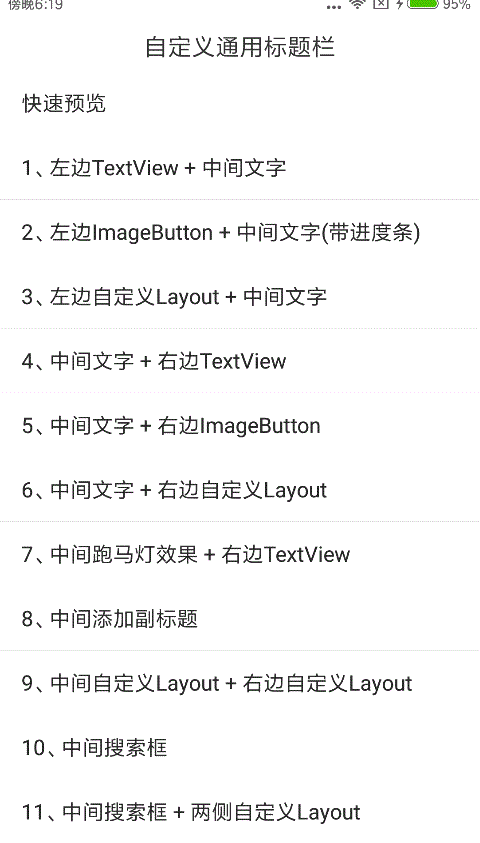
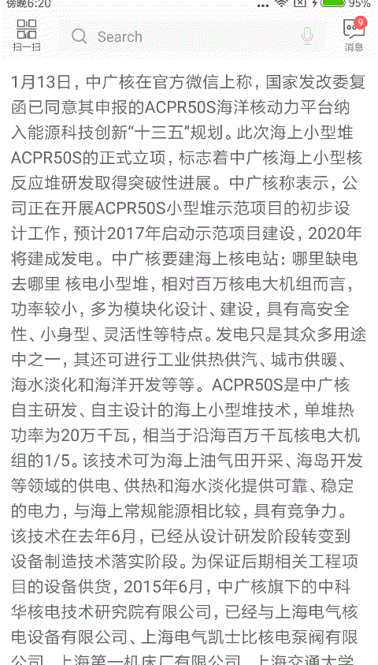
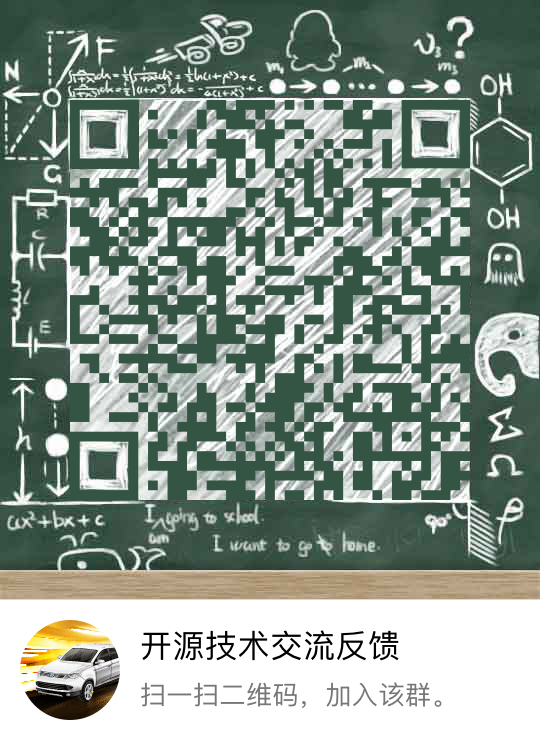

# CommonTitleBar

开发过程中，如果页面过多，需要构建大量重复的标题栏布局，浪费开发时间且不利于后期维护。本项目总结了几种常用的使用场景，将标题栏封装成控件，Java代码实现，对当前主流的沉浸式提供了支持，供有需要的同学使用，欢迎提供改进意见。

[Demo下载](https://fir.im/qj2a)

功能描述
=======
1. 支持左、中、右常规标题栏设置；  
2. 支持自定义视图；  
3. 支持沉浸式标题栏；

|首页|快速预览|
|:---:|:---:|
|||

|中间自定义+右边自定义|中间搜索框+左右自定义|
|:---:|:---:|
|||

使用介绍
=======

[ ](https://bintray.com/wuhenzhizao/maven/titlebar/_latestVersion)

添加依赖
```xml
buildscript {
    allprojects {
        repositories {
            jcenter()
        }
    }
}

dependencies {
    compile 'com.wuhenzhizao:titlebar:1.1.2'
}
```

布局中引入控件
```xml
<com.wuhenzhizao.titlebar.widget.CommonTitleBar
    xmlns:titlebar="http://schemas.android.com/apk/res-auto"
    android:id="@+id/titlebar"                     
    android:layout_width="match_parent"
    android:layout_height="wrap_content"
    titlebar:titleBarColor="color"             // 标题栏背景颜色
    titlebar:fillStatusBar="boolean"           // 填充状态栏，true时，标题栏会创建一块和系统状态栏同高的视图，用于沉浸式标题栏
    titlebar:statusBarColor="color"            // 使用沉浸式标题栏时，标题栏显示的颜色
    titlebar:statusBarMode="dark|light"        // 状态栏图标模式，默认是暗色图标
    titlebar:titleBarHeight="dimension"        // 标题栏高度
    titlebar:showBottomLine="boolean"          // 是否显示标题栏底部的分割线   
    titlebar:bottomLineColor="color"           // 标题栏分割线颜色
    titlebar:bottomShadowHeight="dimension"    // 底部阴影高度 showBottomLine = false时有效
    titlebar:leftType="none|textView|imageButton|customView"    // 左侧视图类型：无|文字|按钮|自定义视图
    titlebar:leftText="string"                 // 左侧文字leftType= textView有效
    titlebar:leftTextColor="color"             // 左侧文字颜色
    titlebar:leftTextSize="dimension"          // 左侧文字大小
    titlebar:leftDrawable ="reference"         // leftType= textView时，对应的drawableLeft图片
    titlebar:leftDrawablePadding="dimension"   // leftType= textView时，对应的drawablePadding
    titlebar:leftImageResource="reference"     // leftType= imageButton时，左侧按钮对应的图片资源引用
    titlebar:leftCustomView ="reference"       // leftType= customView时，左侧布局资源引用
    titlebar:rightType="none|textView|imageButton|customView"   // 右侧视图类型：无|文字|按钮|自定义视图
    titlebar:rightText="string"                // 右侧文字rightType= textView有效
    titlebar:rightTextColor="color"            // 右侧文字颜色
    titlebar:rightTextSize="dimension"         // 右侧文字大小
    titlebar:rightImageResource="reference"    // rightType= imageButton时，右侧按钮对应的图片资源引用
    titlebar:rightCustomView="reference"       // rightType= customView时，右侧布局资源引用
    titlebar:centerType="none|textView|searchView|customView"   // 中间视图类型：无|文字|搜索框|自定义视图
    titlebar:centerSearchRightType="voice|delete"               // 搜索框右侧按钮类型：语音按钮|删除按钮
    titlebar:centerText="string"               // 标题文字centerType = textView有效
    titlebar:centerTextColor="color"           // 标题文字颜色
    titlebar:centerTextSize="dimension"        // 标题文字大小
    titlebar:centerSubText="string"            // 副标题文字
    titlebar:centerSubTextColor="color"        // 副标题文字颜色
    titlebar:centerSubTextSize="dimension"     // 副标题文字大小
    titlebar:centerSearchEdiable="boolean"     // 搜索框是否可以输入，对应centerType =searchView
    titlebar:centerSearchBg="reference"        // 搜索框背景
    titlebar:centerCustomView="reference"/>    // 中间自定义视图
```  

监听标题栏操作
=========== 
**点击事件**

```java
titleBar.setListener(new CommonTitleBar.OnTitleBarListener() {
    @Override
    public void onClicked(View v, int action, String extra) {
        if (action == CommonTitleBar.ACTION_LEFT_TEXT) {
            ...
        }
        // CommonTitleBar.ACTION_LEFT_TEXT;        // 左边TextView被点击
        // CommonTitleBar.ACTION_LEFT_BUTTON;      // 左边ImageBtn被点击
        // CommonTitleBar.ACTION_RIGHT_TEXT;       // 右边TextView被点击
        // CommonTitleBar.ACTION_RIGHT_BUTTON;     // 右边ImageBtn被点击
        // CommonTitleBar.ACTION_SEARCH;           // 搜索框被点击,搜索框不可输入的状态下会被触发
        // CommonTitleBar.ACTION_SEARCH_SUBMIT;    // 搜索框输入状态下,键盘提交触发，此时，extra为输入内容
        // CommonTitleBar.ACTION_SEARCH_VOICE;     // 语音按钮被点击
        // CommonTitleBar.ACTION_SEARCH_DELETE;    // 搜索删除按钮被点击
        // CommonTitleBar.ACTION_CENTER_TEXT;      // 中间文字点击
    }
});
```

**双击事件**

```java
titleBar.setDoubleClickListener(new CommonTitleBar.OnTitleBarDoubleClickListener() {
    @Override
    public void onClicked(View v) {
        Toast.makeText(MainActivity.this, "Titlebar double clicked!", Toast.LENGTH_SHORT).show();
    }
});
```

**自定义布局事件(以右侧自定义布局为例)**

```java
View rightCustomLayout = titleBar.getRightCustomView();
rightCustomLayout.setOnClickListener(new View.OnClickListener() {
    @Override
    public void onClick(View v) {

    }
});
// 布局child view添加监听事件
rightCustomLayout.findViewById(R.id.子控件ID).setOnClickListener(new View.OnClickListener() {
    @Override
    public void onClick(View v) {

    }
});
```

**动态切换状态栏图标颜色**

```java
titleBar.toggleStatusBarMode();
```  

注意点
=====
1. 如果出现全屏与键盘的冲突导致的键盘被遮挡问题，请在Activity.onAttachedToWindow()方法中加入如下代码，或在布局根节点加入 fitSystemWindow=true

```java
  @Override
  public void onAttachedToWindow() {
      super.onAttachedToWindow();
      KeyboardConflictCompat.assistWindow(getWindow());
  }
```


最近的重心
========
[Kotlin-Adapter: 使用kotlin语法的BaseAdapter，语法简单，支持多种样式，支持多种效果，欢迎加star](https://github.com/wuhenzhizao/kotlin-adapter)

技术交流
======
|QQ交流群|
|:---:|
||

License
=======
```
Copyright 2017 wuhenzhizao

Licensed under the Apache License, Version 2.0 (the "License");
you may not use this file except in compliance with the License.
You may obtain a copy of the License at

   http://www.apache.org/licenses/LICENSE-2.0

Unless required by applicable law or agreed to in writing, software
distributed under the License is distributed on an "AS IS" BASIS,
WITHOUT WARRANTIES OR CONDITIONS OF ANY KIND, either express or implied.
See the License for the specific language governing permissions and
limitations under the License.
```


